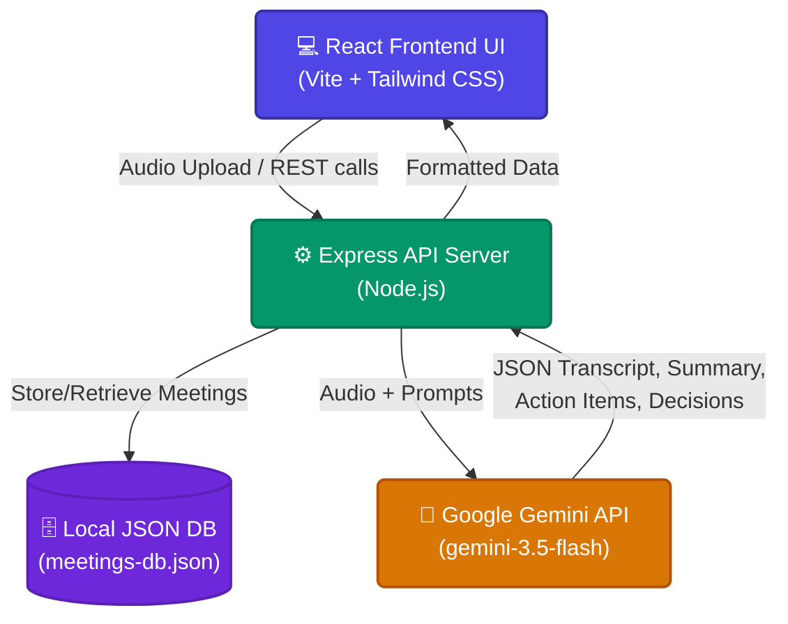

<h1 align="center">🎙️ AI Meeting Recorder</h1>

<p align="center">
  <strong>Record, Transcribe, and Summarize your meetings using Google's Gemini AI.</strong>
</p>

<p align="center">
  <a href="https://ai-meeting-recorder-1092415503095.asia-southeast1.run.app/"><strong>🟢 View Live Demo</strong></a>
</p>

## ✨ Features

- **Audio Processing**: Upload audio to automatically generate accurate, multi-speaker meeting transcripts.
- **AI-Powered Insights**: Automatically extracts comprehensive summaries, action items, and key decisions using the `gemini-3.5-flash` model.
- **Multilingual Support**: Supports transcribing and summarizing in both English and Vietnamese natively.
- **Q&A Assistant**: Chat directly with the AI assistant to ask specific questions based on the meeting's context.
- **Export Data**: Easily export meeting notes into Markdown or Plain Text formats.
- **Dashboard Overview**: View total meeting minutes, pending action items, and completed sessions.

## 🏗 Architecture



## 🛠 Tech Stack

- **Frontend**: React 19, Vite, Tailwind CSS v4, Motion (Animations)
- **Backend**: Express.js (Node.js)
- **AI Engine**: Google GenAI SDK (`@google/genai`)
- **Database**: Local JSON Database (`meetings-db.json`)

## 🚀 Getting Started

### Prerequisites
- [Node.js](https://nodejs.org/) (v18 or higher recommended)
- A Google Gemini API Key

### Installation

1. **Clone the repository and install dependencies:**
   ```bash
   npm install
   ```

2. **Configure Environment Variables:**
   Create a `.env` or `.env.local` file in the root directory and add your Gemini API Key:
   ```env
   GEMINI_API_KEY="your_google_gemini_api_key_here"
   ```

3. **Run the Development Server:**
   ```bash
   npm run dev
   ```
   The application will start running the Express API and the Vite frontend on `http://localhost:3000`.

## 📦 Build for Production

To create a production build of the app:

```bash
npm run build
npm start
```

## 🔗 AI Studio

View your app in AI Studio: [https://ai.studio/apps/5d1127c2-5adb-4744-9a1e-785629246c6c](https://ai.studio/apps/5d1127c2-5adb-4744-9a1e-785629246c6c)

## 📝 License

This project is licensed under the Apache 2.0 License.
